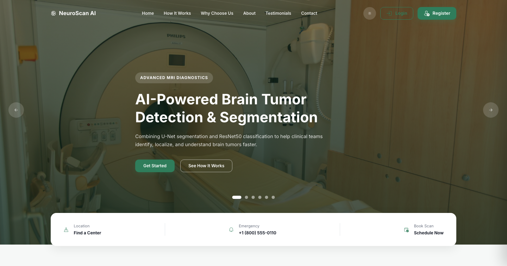
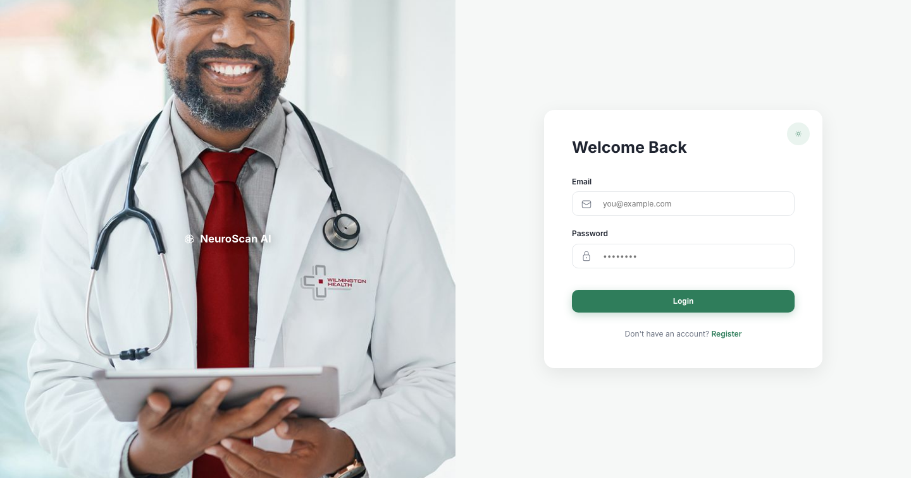
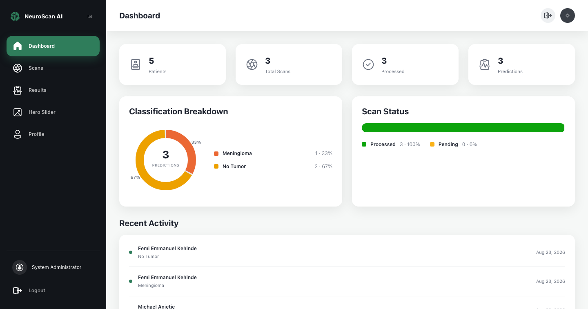
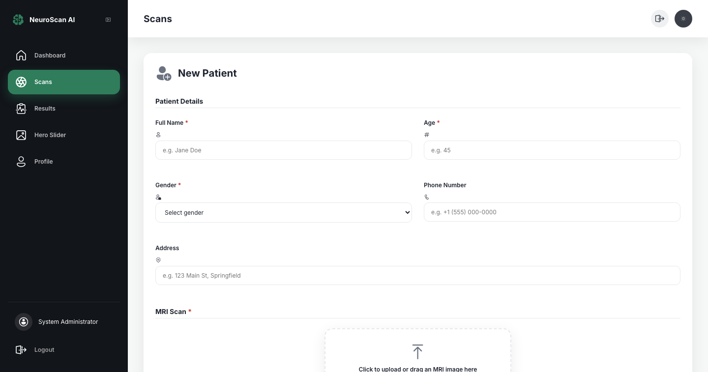
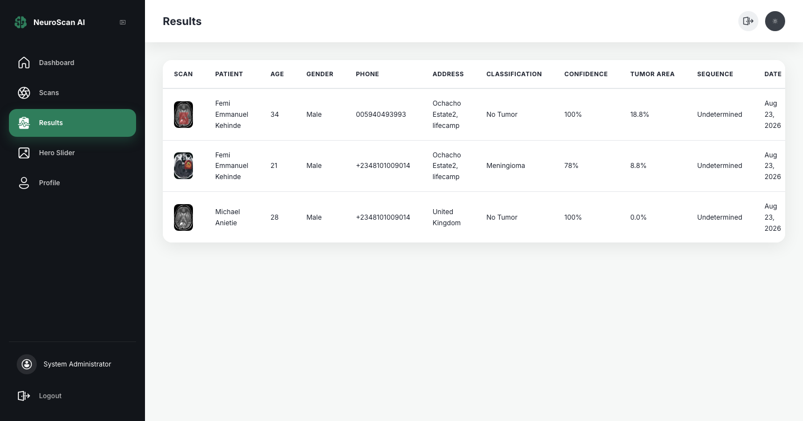

# NeuroScan AI

**AI-powered brain tumor detection and segmentation for clinical workflows.**

NeuroScan AI is a full-stack Flask web application that lets clinical staff register a patient, upload a brain MRI scan, and receive an AI-generated tumor classification, a segmented (highlighted) image showing where the tumor is, and an estimate of tumor area — all within seconds, from a single dashboard.



---

## Table of Contents

- [Overview](#overview)
- [Key Features](#key-features)
- [Machine Learning Pipeline](#machine-learning-pipeline)
- [Tech Stack](#tech-stack)
- [Screenshots](#screenshots)
- [Project Structure](#project-structure)
- [Data Model](#data-model)
- [Getting Started](#getting-started)
  - [Prerequisites](#prerequisites)
  - [Installation](#installation)
  - [Environment Variables](#environment-variables)
  - [Seeding Demo Data](#seeding-demo-data)
  - [Running the App](#running-the-app)
- [Usage Guide](#usage-guide)
- [Deployment](#deployment)
- [Security](#security)
- [Design System](#design-system)
- [Known Limitations](#known-limitations)
- [License](#license)

---

## Overview

NeuroScan AI targets a very concrete clinical workflow: a doctor or radiographer has a patient in front of them, an MRI slice in hand, and needs a fast, second-opinion read on whether the scan shows a tumor, what kind, and roughly how large it is — before a specialist has time to review it in full.

The app is built around that single workflow end to end:

1. **Register the patient** and upload their MRI scan in one form.
2. **The AI pipeline runs automatically** — classification, segmentation, and an estimate of MRI sequence type — with no manual steps.
3. **The result is immediately visible** on the scan page, and permanently recorded in a searchable, paginated results table.
4. **A dashboard** gives an at-a-glance view of scan volume, classification breakdown, and recent activity across all patients.

It is not a toy demo wired to a mocked API — the classification and segmentation models are real, pretrained neural networks that run inference on every upload, described in detail below.

---

## Key Features

### Authentication & Accounts
- Email/password registration and login, with passwords hashed via Werkzeug's `generate_password_hash`/`check_password_hash` (never stored in plain text).
- Role-based accounts (`admin`, `doctor`, `user`) — the Hero Slider CMS is restricted to admins.
- A full **Account Settings** page: update name and email, or set a new password, all gated behind re-entering the current password.
- Session-based auth via Flask-Login, with CSRF protection on every form via Flask-WTF.

### Patient Intake & Scan Upload
- A single combined form: patient details (full name, age, gender, phone, address) and the MRI image upload, submitted together.
- Drag-and-drop or click-to-browse image upload, with a live preview before submission.
- Client-side and server-side validation (required fields, file type restricted to PNG/JPG, 16 MB max upload size).
- **Non-MRI image detection**: before any AI inference runs, uploaded images are screened to catch obviously-wrong uploads — a Colour photo, a screenshot, a document — and rejected with a clear message, rather than silently producing a meaningless "result." See [Machine Learning Pipeline](#machine-learning-pipeline) for how this works.
- A visible "analyzing" state while inference runs, so the user always knows the system is working.

### AI-Assisted Diagnosis
- **Classification** into one of four classes — Glioma, Meningioma, Pituitary, or No Tumor — with a confidence score.
- **Segmentation**: the tumor region (if any) is highlighted directly on the scan image with a red overlay, and the tumor's area is reported as a percentage of the total scan.
- **MRI sequence estimation**: a heuristic estimate of whether the uploaded slice looks like a T1-weighted or T2/FLAIR-weighted scan, clearly labelled as an estimate rather than a certainty.
- Every result is permanently attached to the patient's record and visible in the Results table.

### Dashboard & Analytics
- Live counters for total patients, total scans, processed scans, and total predictions.
- A classification-breakdown donut chart and a scan-status bar, both computed live from the database (not hardcoded).
- A recent-activity feed showing the latest patients scanned and their outcome.
- A dedicated, paginated **Results** table listing every patient, their scan thumbnail, full intake details, and the AI's classification, confidence, tumor area, sequence estimate, and date — with a one-click delete (behind a confirmation dialog) for any record.

### Hero Slider CMS (Admin)
- Admins can manage the rotating hero images shown on the public landing page.

### Public Landing Page
- A marketing site with a rotating hero slider, a live stats section pulled from the same database the dashboard uses, a "How It Works" step-by-step carousel, a "Why Choose Us" feature section, an About section, testimonials, and a contact section with an embedded map.

### Design & Accessibility
- A consistent design system (see [Design System](#design-system)) applied across the public site, auth pages, and the internal dashboard.
- Full light/dark mode, remembered across sessions.
- Responsive down to 320px-wide viewports.
- SweetAlert2-powered flash messages and confirmation dialogs throughout, instead of native browser alerts.

---

## Machine Learning Pipeline

Every uploaded scan runs through a multi-stage pipeline (`app/ml/inference.py`) before a result is ever shown to the user:

### 1. Non-MRI Screening
Before any model runs, the image is screened with a fast, non-ML heuristic to catch uploads that clearly aren't MRI scans at all. It checks two independent properties of the image:

- **Border uniformity** — a real scan is a roughly circular/oval region on a plain background that doesn't fill the rectangular frame, so the outer border of the image is overwhelmingly one value. An ordinary photo (a person, a room, equipment) has real content running edge to edge, so its border is a mix of many different values. This check works in grayscale, so it correctly accepts scans with an unusual tint or colour mapping, not just neutral black-and-white ones.
- **Near-white area** — a flat white background is essentially never part of a real scan. This is what catches screenshots and documents specifically.

If an upload fails this screen, it's rejected immediately with a clear message, and — importantly — **no patient or scan record is created**: nothing is written to the database and the uploaded file is deleted, so a rejected upload leaves no trace to clean up later.

### 2. Classification — ResNet50
Once an image passes the MRI screen, it's classified using a **ResNet50** convolutional neural network, fine-tuned on brain MRI scans to distinguish four classes:

| Class | Meaning |
|---|---|
| Glioma | A tumor arising from glial cells |
| Meningioma | A tumor arising from the meninges |
| Pituitary | A tumor of the pituitary gland |
| No Tumor | No tumor detected |

The model returns both the predicted class and a confidence score, both of which are shown to the user and stored with the result — the app never hides or rounds away a low-confidence result as if it were certain.

### 3. Segmentation — U-Net
In parallel, the same image is run through a **U-Net** segmentation network, which traces the tumor's boundary at the pixel level. The predicted region is painted onto a copy of the scan as a translucent red overlay, and the tumor's area is computed as a percentage of the total image area. This gives the clinician a visual answer ("where is it, and how big") alongside the classifier's categorical answer ("what is it").

### 4. Sequence Type Estimation
A lightweight, clearly-labelled heuristic estimates whether the uploaded slice is more likely T1-weighted or T2/FLAIR-weighted, based on the relative brightness of the ventricular region (CSF) versus surrounding tissue — a textbook rule of thumb (CSF reads dark on T1, bright on T2). This is explicitly presented as an *estimate*, not a certainty, since sequence type is normally read from DICOM metadata that a plain JPEG/PNG upload doesn't carry.

### Model Loading
Both models are loaded lazily on first use and cached in memory for the lifetime of the process, so the very first scan after a server (re)start takes a little longer while weights are fetched, and every scan after that is fast.

---

## Tech Stack

**Backend**
- [Flask](https://flask.palletsprojects.com/) (application factory pattern, blueprints)
- [Flask-SQLAlchemy](https://flask-sqlalchemy.palletsprojects.com/) — ORM
- [Flask-Login](https://flask-login.readthedocs.io/) — session authentication
- [Flask-WTF](https://flask-wtf.readthedocs.io/) — forms and CSRF protection
- SQLite (local development) / PostgreSQL (production, via `DATABASE_URL`)

**Machine Learning**
- [PyTorch](https://pytorch.org/) — model runtime
- [Transformers](https://huggingface.co/docs/transformers) (Hugging Face) — classification pipeline
- [Ultralytics](https://www.ultralytics.com/) — segmentation pipeline
- [Hugging Face Hub](https://huggingface.co/docs/huggingface_hub) — model weight distribution
- NumPy / Pillow — image and array processing

**Frontend**
- Server-rendered Jinja2 templates (no SPA framework)
- Vanilla JavaScript for interactivity (sliders, dropzone, theme toggle, scroll reveal)
- [Iconify](https://iconify.design/) (Microsoft Fluent icon set), loaded live via the `<iconify-icon>` web component
- [SweetAlert2](https://sweetalert2.github.io/) for flash messages and confirmation dialogs
- Hand-written CSS design system with light/dark theming via CSS custom properties

**Infrastructure**
- [Gunicorn](https://gunicorn.org/) — production WSGI server
- [Render](https://render.com/) — deployment target (see [Deployment](#deployment))

---

## Screenshots

### Public landing page
Rotating hero slider, live stats pulled from the database, and a full marketing site.


### Login


### Dashboard
Live patient/scan counters, a classification-breakdown chart, scan status, and a recent-activity feed.



### New scan intake
Combined patient-details and MRI-upload form, with drag-and-drop.



### Results
Every patient's scan, classification, confidence, tumor area, and estimated sequence, in one paginated table.



---

## Project Structure

```
brain-cancer-app/
├── app/
│   ├── __init__.py            # Application factory, extension setup
│   ├── models.py              # SQLAlchemy models (User, Patient, Scan, Prediction, ...)
│   ├── forms.py                # Flask-WTF forms
│   ├── decorators.py          # Route decorators (e.g. admin_required)
│   ├── icons.py                # Jinja `icon()` helper (renders Iconify icons)
│   ├── seed.py                  # Demo data seeding (flask seed-db)
│   ├── ml/
│   │   └── inference.py       # Full ML pipeline: MRI screening, classification, segmentation
│   ├── routes/
│   │   ├── main.py             # Public landing page
│   │   ├── auth.py             # Register / login / logout
│   │   ├── dashboard.py       # Dashboard, scans, results, profile, slider CMS
│   │   └── ml.py                # Scan upload + inference endpoint
│   ├── templates/
│   │   ├── base.html            # Shared layout, theme bootstrapping
│   │   ├── landing.html        # Public landing page
│   │   ├── auth/                 # Login / register / shared visual panel
│   │   └── dashboard/          # Dashboard, scans, results, profile, slider CMS
│   └── static/
│       ├── css/                  # style.css (site-wide), dashboard.css, auth.css
│       ├── js/                    # main.js, dashboard.js, reveal.js, theme.js, alerts.js
│       ├── img/                   # Static brand/marketing imagery, favicons
│       └── uploads/             # Uploaded scans + hero slider images (runtime data)
├── docs/
│   └── screenshots/            # Screenshots used in this README
├── config.py                    # Environment-driven configuration
├── run.py                        # Local entry point
├── render.yaml                  # Render Blueprint (web service + DB + disk)
├── render-start.sh              # Production start script
├── requirements.txt
└── DEPLOY.md                    # Render deployment walkthrough
```

---

## Data Model

| Model | Purpose |
|---|---|
| `User` | Application accounts (`admin` / `doctor` / `user` roles), password hash, avatar |
| `Patient` | A patient on whom scans are performed — name, age, gender, phone, address |
| `Scan` | An uploaded MRI image linked to a patient, its segmented output, and processing status |
| `Prediction` | The AI result for a scan: classification, confidence, tumor area %, sequence estimate |
| `SliderImage` | Hero slider images shown on the public landing page, managed by admins |
| `Testimonial` | Testimonials shown on the public landing page |

`Patient → Scan → Prediction` cascade on delete, so removing a patient (or a single scan result from the Results table) cleanly removes everything attached to it, including the uploaded image files on disk.

---

## Getting Started

### Prerequisites
- Python 3.11
- ~2 GB of free disk space for model weights (downloaded automatically on first scan)
- macOS/Linux recommended (Windows works, but paths in examples below assume a POSIX shell)

### Installation

```bash
git clone <this-repo-url>
cd brain-cancer-app

python3 -m venv venv
source venv/bin/activate

pip install -r requirements.txt
```

> `requirements.txt` pins PyTorch to its CPU-only build via `--extra-index-url` — no GPU is required to run this app.

### Environment Variables

| Variable | Required | Default | Purpose |
|---|---|---|---|
| `SECRET_KEY` | Recommended in production | a fixed dev key | Flask session signing |
| `DATABASE_URL` | No | local SQLite file | Set to a PostgreSQL URL in production |

Locally, neither needs to be set — the app falls back to SQLite at `instance/app.db` and a development secret key automatically.

### Seeding Demo Data

To get a working admin account, sample hero slider images, testimonials, and a couple of sample patients/scans to explore the UI immediately:

```bash
FLASK_APP=run.py flask seed-db
```

This creates an admin account (see `app/seed.py` for the generated credentials) along with demo content. If you'd rather start from a completely empty database, skip this step and register the first account yourself.

### Running the App

```bash
FLASK_APP=run.py FLASK_DEBUG=1 flask run
```

Visit `http://127.0.0.1:5000` (or whichever port you choose with `--port`). The database and upload folders are created automatically on first run.

---

## Usage Guide

1. **Register or log in** at `/auth/register` / `/auth/login`.
2. **Go to Scans** in the dashboard sidebar.
3. **Fill in patient details** and drag/drop (or click to browse) an MRI image, then click **Analyze Scan**.
4. Wait for the "analyzing" state to finish — the classification, segmented image, tumor area, and sequence estimate appear on the same page.
5. **View all results** at any time in the **Results** tab, including older scans, with pagination once you have more than a page's worth.
6. **Delete a result** from the Results table via the trash icon — you'll be asked to confirm first, and the record and its files are permanently removed.
7. **Admins only**: manage the public landing page's hero slider images from the **Hero Slider** tab.
8. **Update your account** — name, email, or password — from the **Profile** tab, confirmed with your current password.

---

## Deployment

This repo is deployed to [Render](https://render.com/) as a free-tier Web Service, configured by hand (build command, start command, and env vars set directly in the Render dashboard).

Full walkthrough: **[DEPLOY.md](DEPLOY.md)**.

Key points:
- Free plan has no persistent disk, so uploaded scans and the SQLite database reset on every restart/redeploy unless you additionally wire up a free Postgres database for the DB (see DEPLOY.md) — uploaded images stay ephemeral regardless.
- torch + transformers + ultralytics need real memory once loaded; 512MB (the free plan's RAM) may not be enough, in which case the fix is a paid plan with more RAM.
- A single Gunicorn worker is used intentionally, since each worker loads its own copy of the models into memory.
- A paid Blueprint path (`render.yaml`) also exists for a fully persistent setup (disk + managed Postgres), documented as an alternative in DEPLOY.md.

---

## Security

- Passwords are hashed with Werkzeug's PBKDF2-based hashing — never stored or logged in plain text.
- Every form (login, registration, scan upload, profile updates, deletions) is protected by Flask-WTF's CSRF tokens.
- Dashboard routes are gated behind `@login_required`; the Hero Slider CMS is additionally gated behind an `@admin_required` role check.
- Profile changes (email/password) require re-entering the current password.
- File uploads are restricted by extension (PNG/JPG) and size (16 MB max), and are renamed to a random UUID on save — the original filename is never trusted or used for storage.

---

## Design System

- **Color**: a medical-green primary palette (`#2F7D5B`), with light and dark theme variants defined as CSS custom properties.
- **Icons**: exclusively Microsoft Fluent icons, loaded live via the [Iconify](https://iconify.design/) CDN — no custom or mismatched icon sets.
- **Typography**: a compact, Claude-style font stack for high information density in the dashboard.
- **Motion**: scroll-triggered reveal animations (fade + directional slide) on the public site, built on `IntersectionObserver` with no external animation library.
- **Feedback**: all flash messages and confirmation dialogs go through SweetAlert2, replacing native browser `alert()`/`confirm()` entirely.
- **Responsiveness**: tested down to a 320px viewport width.

---

## Known Limitations

Being transparent about what this app does and doesn't guarantee:

- **This is not a certified diagnostic tool.** It's built to demonstrate an AI-assisted clinical workflow, not to replace a radiologist's judgement.
- **MRI sequence estimation is a heuristic**, not a trained classifier — it's a coarse, textbook rule of thumb that can be wrong on off-center or non-axial slices, and is always labelled "estimated" in the UI rather than asserted as fact.
- **Non-MRI upload detection is a coarse screen**, not a trained classifier — it reliably catches ordinary photos, screenshots, and documents, but can't catch a grayscale image of the wrong anatomical subject (e.g. a chest X-ray) framed the same way as a brain scan.
- **Confidence scores are shown as-is.** The app does not hide, round, or reinterpret a low-confidence prediction as if it were certain.

---

## License

This project was built for research/educational purposes. Add your chosen license here.
